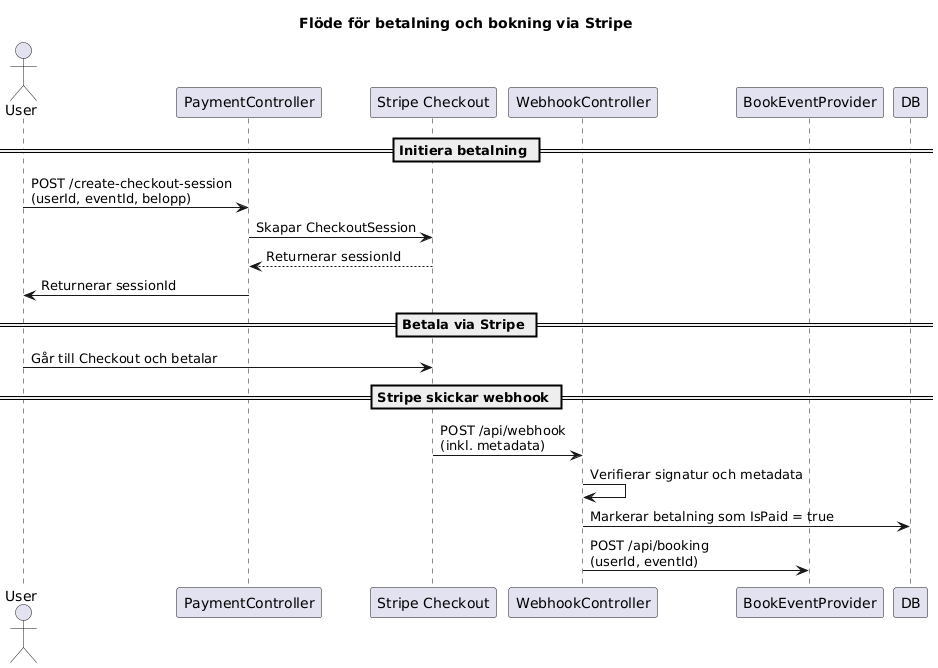

# 💳 Payment Provider

**Payment Provider** är en mikrotjänst byggd med **ASP.NET Core Web API** som hanterar betalningar med Stripe.  
Den används tillsammans med andra mikrotjänster som `BookEventProvider` och `AccountServiceProvider`.  
API:et är säkrat med en **API-nyckel** och dokumenteras via **Swagger UI**.

---

## 🧩 Funktionalitet

- `POST /api/payment/create-checkout-session`: Skapar en Stripe Checkout-session för betalning.  
- `GET /api/payment/getpayments`: Hämtar betalningar baserat på användarroll.  
- `POST /api/webhook`: Tar emot Stripe-webhooks för att markera betalningar som genomförda och skapa bokningar.  
- Alla endpoints skyddas med `x-Api-Key`.  
- Fullständig dokumentation via Swagger UI.

---

## 🛠️ Teknologier

- .NET 9.0  
- ASP.NET Core Web API  
- Entity Framework Core  
- Stripe.NET SDK  
- SQL Server eller InMemory (beroende på miljö)  
- Swagger / OpenAPI

---

## 🚀 Kom igång

### 1. Klona projektet

```
git clone https://github.com/CMS24-Grupp-5/PaymentProvider.git
cd PaymentProvider
```
2. Konfigurera appsettings.json
```
{
  "ConnectionStrings": {
    "SqlConnection": "Server=.;Database=PaymentDb;Trusted_Connection=True;"
  },
  "Apikeys": {
    "StandardApiKey": "din-hemliga-nyckel"
  },
  "Stripe": {
    "SecretKey": "sk_test_...",
    "WebhookSecret": "whsec_..."
  }
}
```
Vid utveckling används en InMemory-databas om inget annat anges.

3. Bygg och kör projektet
```
dotnet build
dotnet run
```
Swagger UI finns på:

```
https://localhost:<port>/swagger
```
🔐 Säkerhet
Alla endpoints kräver en giltig API-nyckel i HTTP-headern:

```
x-Api-Key: din-hemliga-nyckel
```
📦 Exempel: Anrop och svar
✅ Skapa Checkout-session
http
```
POST /api/payment/create-checkout-session
```
Request body:
```

{
  "userId": "123",
  "eventId": "456",
  "amount": 199,
  "bookedBy": {
    "firstName": "Hadil",
    "lastName": "Nasser",
    "phoneNumber": "0701234567"
  }
}
```
Response:

```
{
  "sessionId": "cs_test_a1b2c3d4"
}
```
📄 Hämta betalningar
```
GET /api/payment/getpayments?userId=123&isAdmin=true
```
Response:

```
[
  {
    "paymentId": "abc123",
    "eventId": "456",
    "amount": 199,
    "isPaid": true
  }
]
```

 Sekvensdiagram: Betalningsflöde

 
